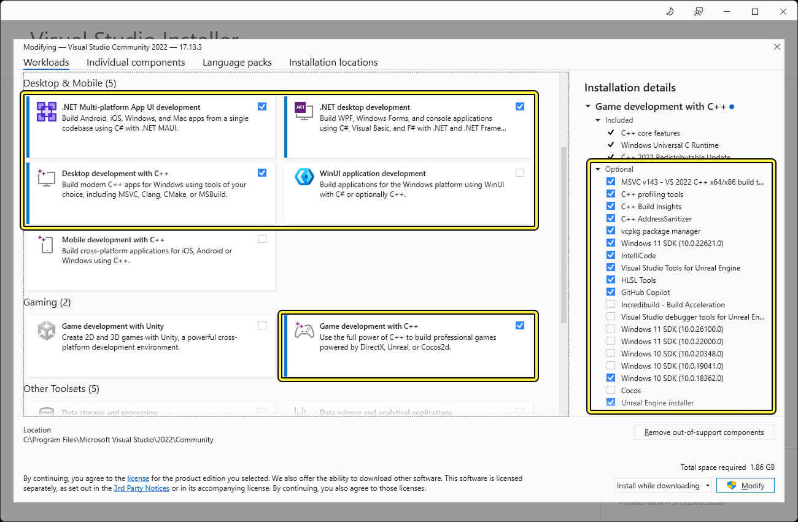
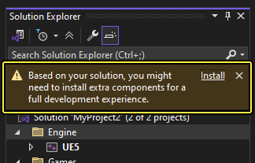

# Unreal Engine 5.6 Build Instructions

Follow these steps to clone and build Unreal Engine 5.6 from source.

## Prerequisites
- A GitHub account linked to your Epic Games account (required to access the repository).
- Visual Studio installed with Game Development with C++ workload.
  
  Please ensure your Visual Studio setup and packages are configured according to the images below:

  
  

## Instructions

1. **Clone the Repository**
   Open your terminal or command prompt and run the following command to clone the 5.6 branch:
   ```bash
   git clone -b 5.6 --single-branch https://github.com/EpicGames/UnrealEngine.git
   ```

2. **Run Setup**
   Navigate into the cloned `UnrealEngine` directory and run the setup script to download necessary binary dependencies:
   ```cmd
   Setup.bat
   ```

3. **Generate Project Files**
   Once the setup script finishes, generate the Visual Studio project files:
   ```cmd
   GenerateProjectFiles.bat
   ```

4. **Build the Engine**
   Open the generated solution file (`UE5.sln`) in Visual Studio. Set your configuration setup to **Development Editor** and your solution platform to **Win64**, then right-click the `UE5` target and select **Build**.

## Troubleshooting

### Compilation Issues
If you follow the steps above and the engine is still failing to compile, clear the Zen Engine Data cache by deleting or cleaning the contents of the following directory:
```
C:\Users\DEV\AppData\Local\UnrealEngine\Common\Zen\Data\projects
```
